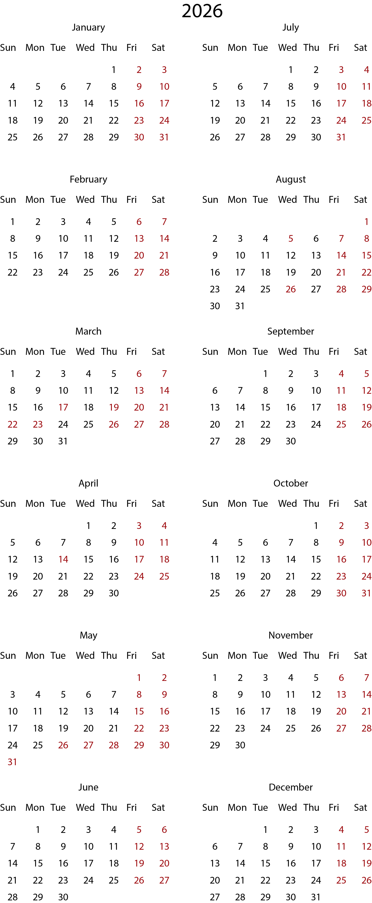

# 📅 Illustrator Calendar Generator

A dynamic calendar generator script for Adobe Illustrator.

## 🚀 Features

- Custom Year Input
- Custom Month & Day Names
- Weekend Selection (Fri/Sat/Custom)
- Start Day Selection
- Holiday Input System
- Optional Grid Layout
- Perfect Date Alignment
- Year Header Display
- Print-ready Layout
  
## 🛠 How to Use

1. Open Adobe Illustrator
2. Go to File → Scripts → Other Script
3. Select the `.jsx` file
4. Follow prompts

## 💡 Built With

- Adobe Illustrator ExtendScript (JavaScript)

## 👨‍💻 Author

Joynal Abedin Mamun 
(@m3mamun)

## 📸 Preview

